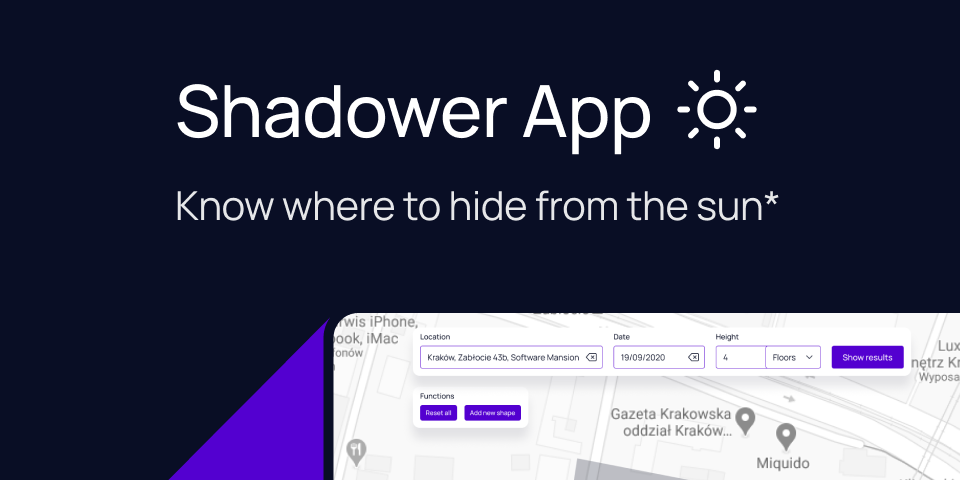

# shadower-app

Have you ever wondered where the shadow will be during the day? Whether it will cover your location at a specific time? Shadower is a tool that shows the shadow of a given object at a given time.



\*Or know where to find the sun 🌞

## Design

Designed by <a href="https://dribbble.com/wodziczka">Daniel Wodziczka</a>

## Preview


## How to use

Create <a href="https://developers.google.com/maps/documentation/javascript/get-api-key">Google Maps API key</a>, paste it into `.env` file:

```
REACT_APP_GOOGLE_MAP_KEY=YOUR_KEY_HERE
```

Start the application with `yarn && yarn start` command.
